# E-Commerce_With_Github_Actions

## Task 1: Project Setup
Step 1: Create GitHub Repository
1. Go to Github 
2. click New repository
3. Name it "ecommerce-platform" 
4. Choose Public (for easier testing) or Private.
5. Add a README (optional).

6. Click Create Repository.

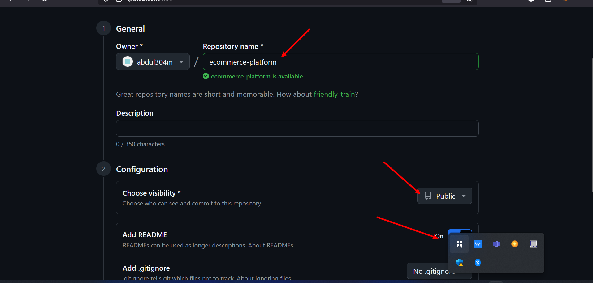

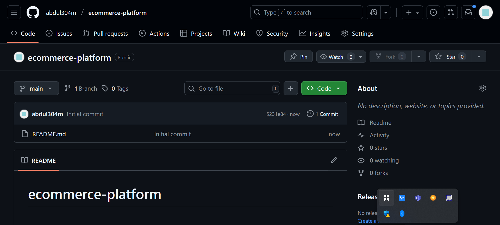

## Clone repository locally:
"https://github.com/abdul304m/ecommerce-platform.git"

- cd ecommerce-platform

## Create project directories:
mkdir api webapp

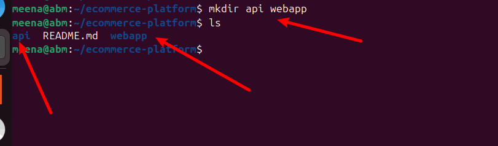

## Commit initial structure:
git add .
git commit -m "Initial project structure"
git push origin main

## Task 2: Initialize GitHub Actions
- Create directory: mkdir -p .github/workflows

- GitHub Actions workflows will go here (ci-backend.yml, ci-frontend.yml).

## Task 3: Backend API Setup
- Initialize Node.js project:
cd api
npm init -y
npm install express

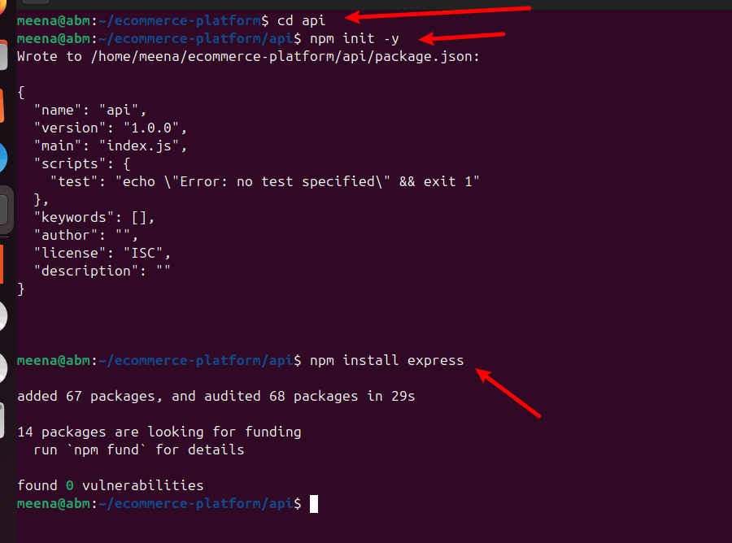

npm install --save-dev jest supertest
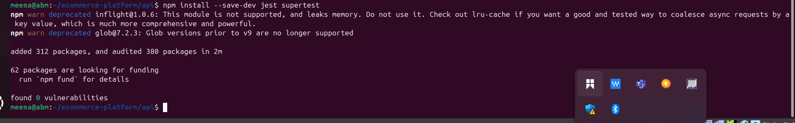.

- Create a simple server (api/index.js):
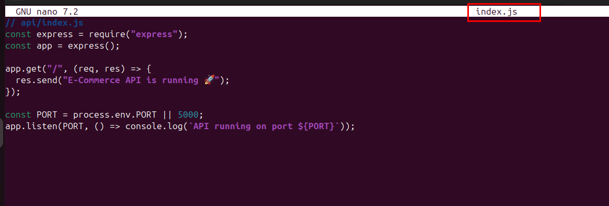

- Add a simple unit test (api/test/api.test.js):
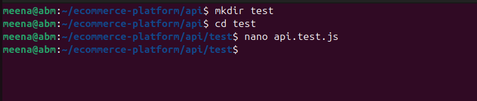

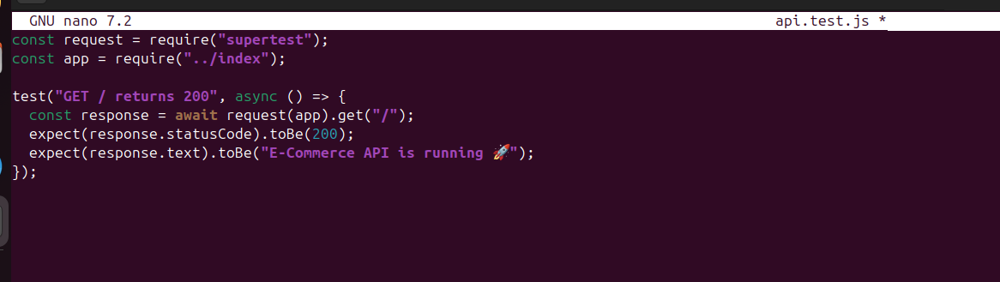

- Add test script in package.json:
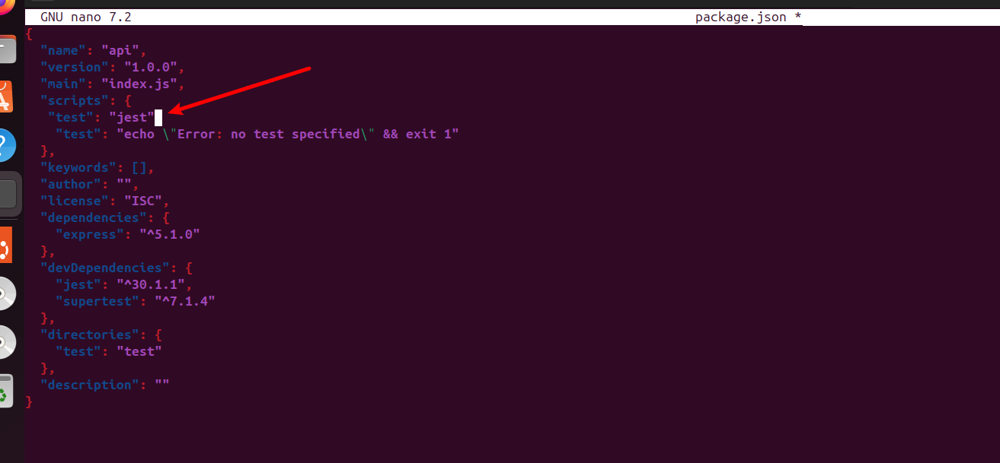.

## Task 4: Frontend Setup
1. Initialize React app:
    cd ../webapp
    npx create-react-app .
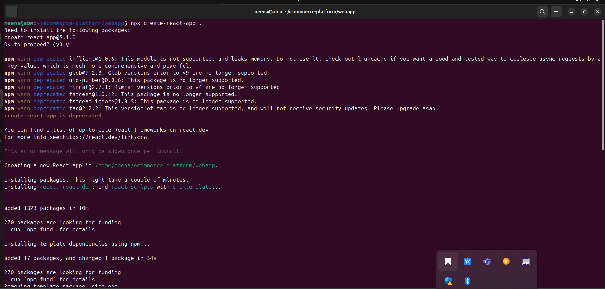.

2. Implement basic features:
- Product listing: fetch from /api/products
- User login
- Order placement

3. Ensure frontend runs locally: "run npm start"

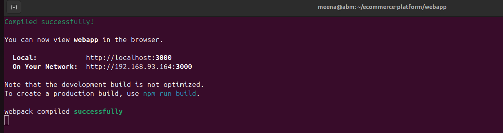

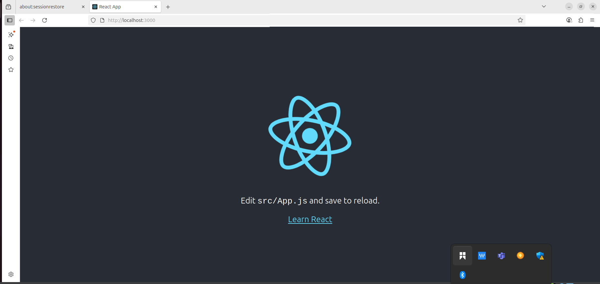

## Task 5: Continuous Integration (CI)
1. Backend workflow (.github/workflows/ci-backend.yml):
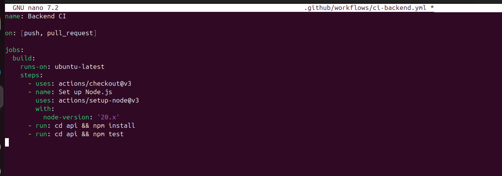

2. Frontend workflow (.github/workflows/ci-frontend.yml):
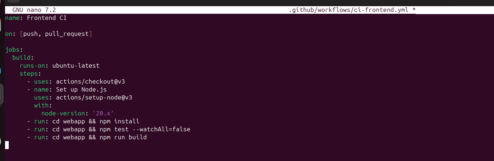

## Task 6: Docker Integration
1. Backend Dockerfile (api/Dockerfile):
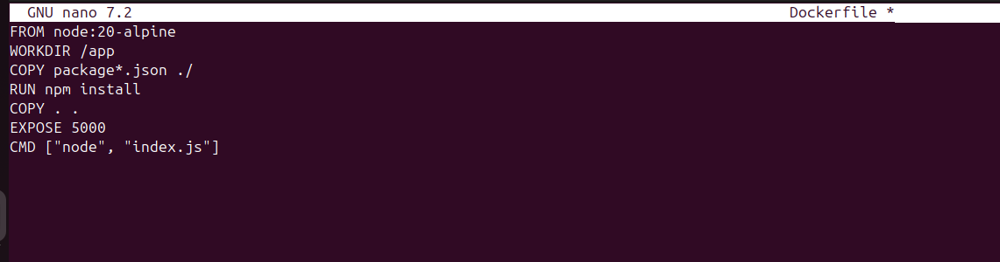

2. Frontend Dockerfile (webapp/Dockerfile):
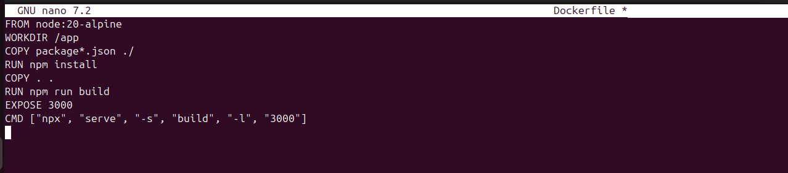

3. Update workflows to build Docker images:
- Backend Workflow (.github/workflows/ci-backend.yml)

Go to your repo root:cd ~/ecommerce-platform
nano .github/workflows/ci-backend.yml
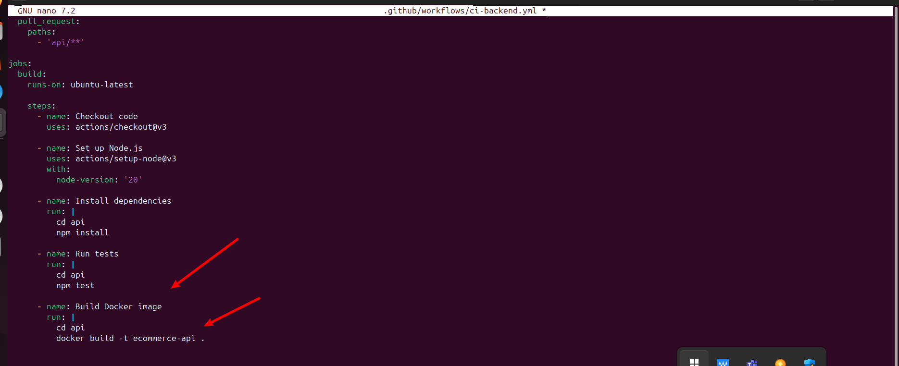

- Frontend Workflow (.github/workflows/ci-frontend.yml)
nano .github/workflows/ci-frontend.yml
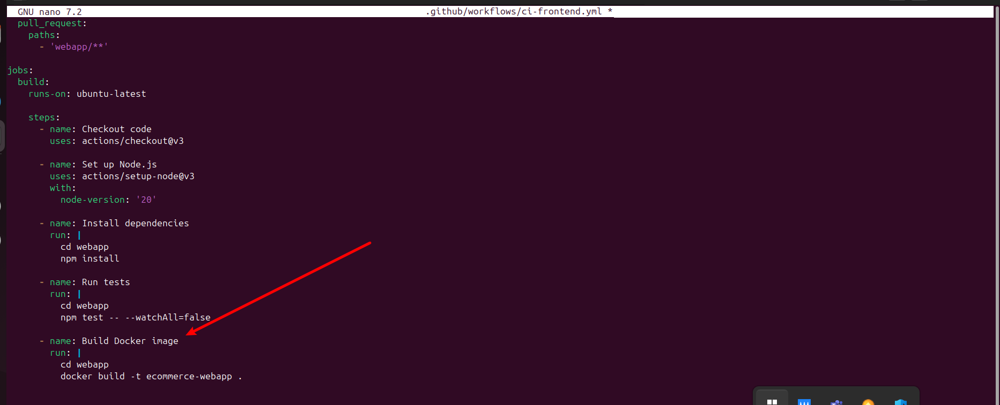.

## Task 7 & 8: Cloud Deployment
- The original requirement was to deploy the application to a cloud provider (AWS, Azure, GCP, or Render).
In this project, I used Docker Hub as the deployment target, which allows me to publish backend and frontend images to a public/private container registry.

Steps Implemented:
- Created a Personal Access Token in Docker Hub for secure authentication.

- Stored credentials in GitHub Secrets:

DOCKERHUB_USERNAME → my Docker Hub username

DOCKERHUB_TOKEN → personal access token

- Updated GitHub Actions workflows to:

Log in to Docker Hub using secrets

Build Docker images for backend and frontend

- Push the images to Docker Hub automatically on each push to main

## Task 9: Performance & Security
- Use GitHub caching for Node modules:

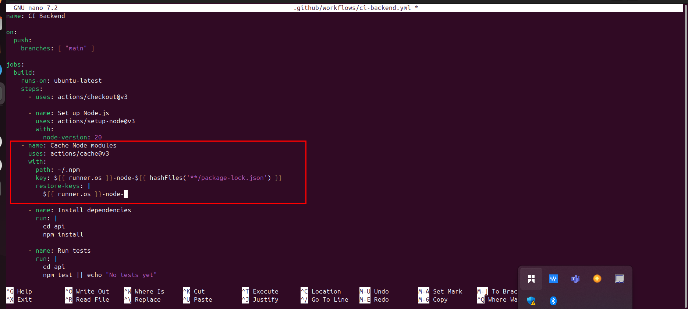

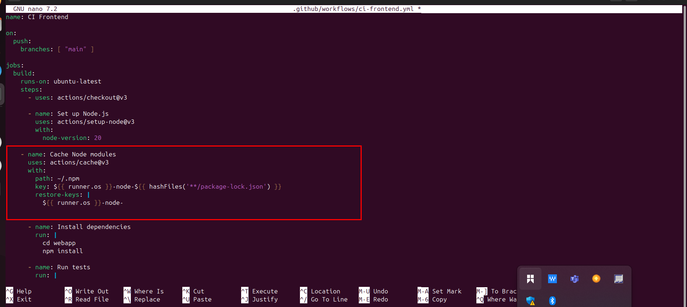

With this plan, you now have a full roadmap and workflow to implement your e-commerce CI/CD project from scratch.